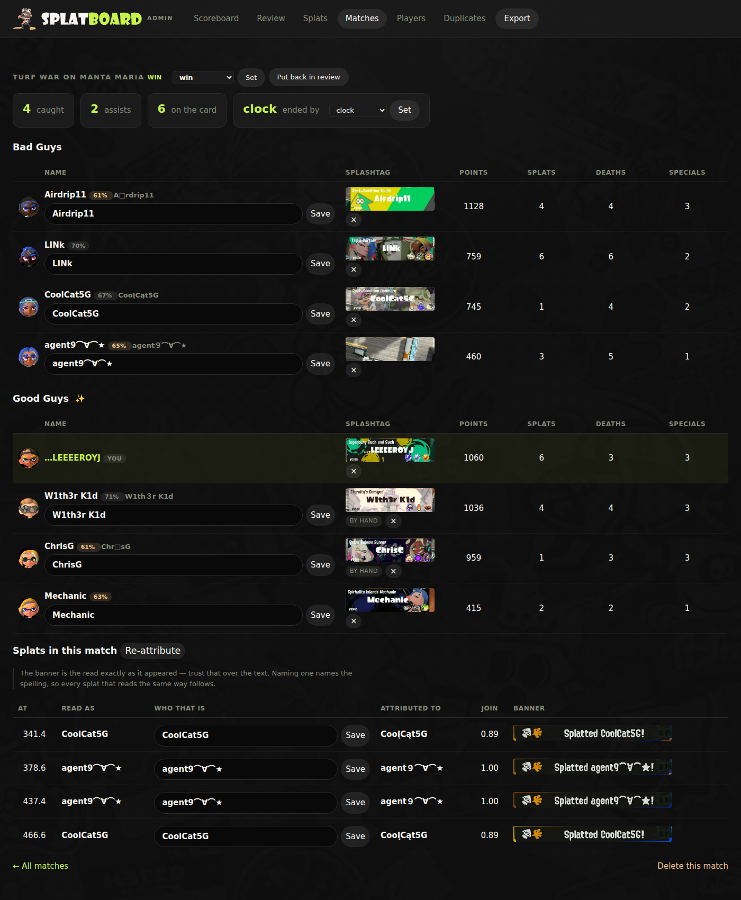
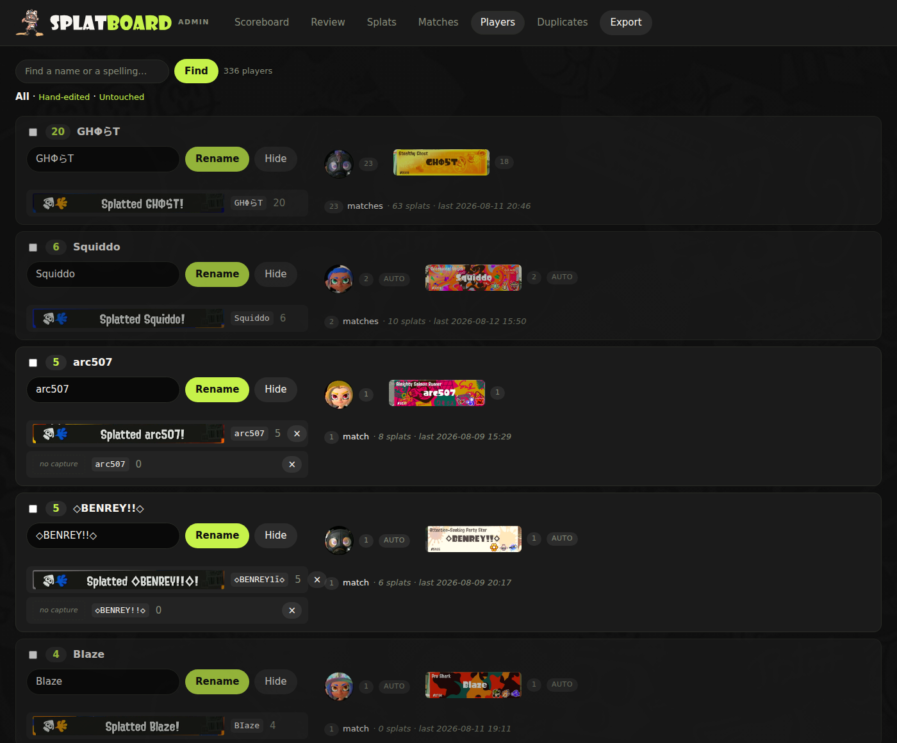

# Splatboard

A ~~scoreboard~~ Wall-of-Squid 🦑 showing players splatted by …LEEEEROYJ in Splatoon 3.

The data comes from reading the game's kill-feed banners and other feedback off my capture card during live game play. The stats aren't typed in by hand, and nothing comes from an API (I wish Splatoon had one!) It's all read off the screen, the same pixels you'd be looking at or would see on a stream.   


***[Click to view …LEEEEROYJ's Splatboard](https://leeeeeroyj.github.io/splatboard/)***

---

## How it works

A Python app watches the capture card and follows a Turf War match from start to finish:

- **The lobby** → knows a match is about to load
- **The intro screen** → grabs all eight splashtags, four a side
- **The match** → catches every `Splatted <name>!` banner as it pops up
- **The results board** → reads all eight rows: points, splats, deaths, specials
- **The next lobby** → closes the match out and starts watching for the next one

Then it works out who splatted whom, which banner belongs to which player, whether I won, and how the match ended.

## Player names are chaos

It doesn't use OCR for player name recognition. Normal text-recognition software is built to read documents, and it didn't do well with a game font over moving artwork. Handed a real Splatoon name, it gave back `=Hudacityx` for `ΞÂudâcîty☆`, and `ORATO` for `◇RAT◇`.

It has [the game's actual font file](https://github.com/North-West-Wind/splatoon3-fonts) to work with, and draws every single character the game can draw, including foreign and special characters. Then it slides them along the banner looking for the arrangement of shapes that best matches the pixels on screen.

Here's a fun one. These two names look identical in the Splatoon BlitzMain font:

```
Sleepy
SIeepy
```

The second one is a capital **I** where the **l** should be. In the game's font they are drawn as the *exact same shape*, one pixel of difference in stroke width. There is no way to tell them apart visually.

It gets worse. There are dozens of characters across different alphabets that draw the same picture. The `e` on your keyboard and the Russian `е` are different characters that look the same. Same for `o`/`о`, `a`/`α`, `p`/`ρ`, `y`/`у`. Splatoon players use these constantly.

So the app keeps a list of every character pair that draws the same shape, and quietly treats them as the same letter when deciding *who somebody is*, while still storing exactly what it read. That gives me a way to check its work. When two names it can't prove are the same still look suspiciously alike, it marks them for me to review. 

## The Admin: Where I fix its mistakes

It's honest about what it isn't sure of. Every match gets checked, and the review page lists the matches it knows I need to clarify (low confidence scores detecting player names, unable to match splashtags to players, etc).

I can review a match, see everything it worked out, and it lets me correct any of it on the fly:



Worth pointing out on that page:

- The little **61%** / **70%** pills are how confident it is about each name. Low numbers get my attention first.
- The greyed text beside a name (`A□rdrip11`, `Chr□sG`) is the **raw read**, exactly what it saw, never overwritten. The evidence survives every correction.
- A `□` means "one character was here, I couldn't read it."
- Each row has its **splashtag** linked to it. It does this by drawing each player's name in the banner font and checking which of the four banners it fits. 
- `BY HAND` means I overruled it. It never overwrites those.
- At the bottom, every splat shows the actual banner image it was read from, and how confidently it was pinned to that player.

And the Players page groups every spelling of one person together:



If someone changes their name, like Jim is J1M and J1MB0, I can group them all as a single player and combine their stats. Each spelling keeps its own screenshot, so I can always see what was really on screen.

## What the board shows

Not all of my matches are included. Only data from when I'm playing at my desk (where my capture card is) and recording the matches.

Career stats, the Wall of Squid (everyone splatted, with their splashtag), the most recent matches, and nine awards handed out across everyone who's shown up:

**Splat Assassin** · **Public Enemy** · **Fastest Splat** · **Nemesis** · **Turf King** · **Hard to Kill** · **Lucky Charm** · **Boogeyman** · **Top Squad**

One bit of honesty: I'm only monitoring the splat notifications that pop up when I splat someone. I'm not detecting when I get splatted and who got credit for splatting *me*. So "Public Enemy" means most splats against my **team**, not against me personally. 

## How it gets published

I hit Export in the admin. It writes the board (HTML page, data, splashtags and icons) into a folder that is its own GitHub repo. Pushing that repo rebuilds the live site. No server, no database on the internet, just a static page.

---

<sup>**Not affiliated with Nintendo** - Splatboard is a personal development project and is not affiliated with, endorsed by, or sponsored by Nintendo. Splatoon and Splatoon 3 are trademarks of Nintendo. <br> Thanks [Cat with Monocle](https://catwithmonocle.com/news/2022/09/07/splatoon-3-pattern-version-2-wallpaper/) for the Splatboard background.</sup>

Made with 🫟 and 🤖 by …LEEEEROYJ
